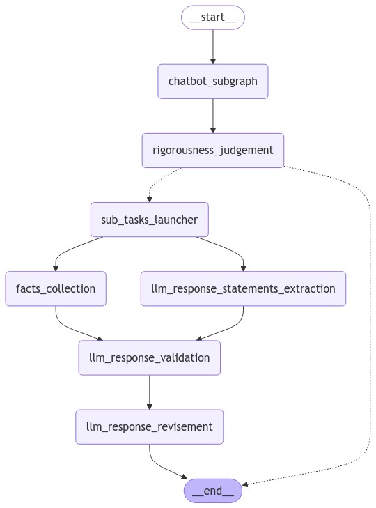

# Rigorous LLM 

This is my very preliminary project of developing an LLM agent that only includes the truth or facts in the responses when a user's query requires rigorousness. 

I will use LangGraph to implement my "version alpha", but the idea/concept is not limited by LLM agent frameworks (e.g., LangGraph). 

## Key Idea 

The current method is illustrated by the following figure. 

* **chatbot_subgraph**: This is just a "normal" chatbot which takes a user query and generates an LLM responses. 

* **rigorousness_judgement**: 
    - This is to judge if the user query requires "rigorousness". For example, user request like "tell me a story" does not require rigorousness. On the other hand, "What is Google LLC?" does. 
    - If the stage does not consider the rigorousness is required by the query, the workflow will just get to the "END" -- just returns **chatbot_subgraph** response. 

* **facts_collection**: This will collect "facts" in different ways. The current implementation is just extracting facts from the tool usages. It will be revised in the later versions. 

* **llm_response_validation**: This will validate the LLM response (the output of **chatbot_subgraph**) by the following steps: 
    - Decompose the LLM response into statements. 
    - Validate each statement against the facts collected in **facts_collection**.

* **llm_response_revisement**: This will re-compose the LLM response with the statements that pass the validation in **llm_response_validation** stage. 

## Demo 

Please see my notebook [README.ipynb](./README.ipynb) as a "demo". 